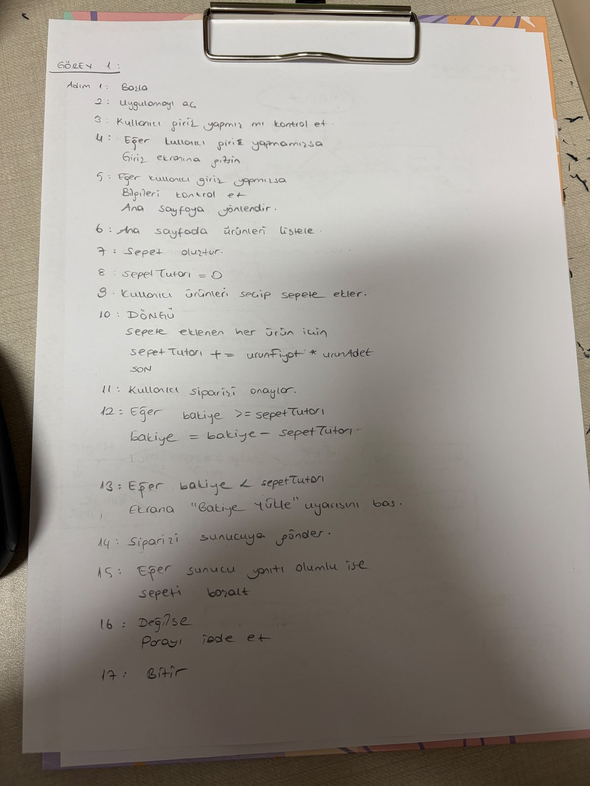
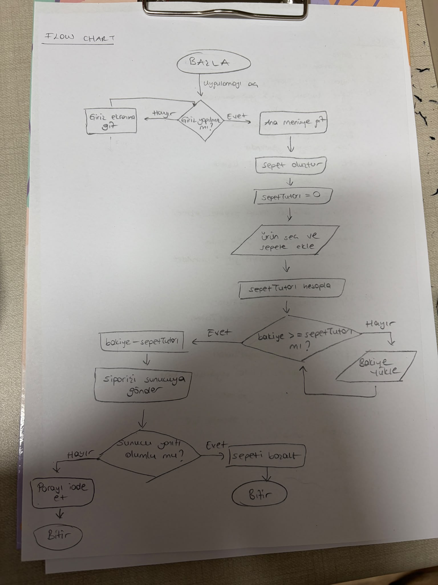

# KAHVEGO MOBİL KAHVE SİPARİŞ UYGULAMASI 

# GÖREV 1

  

# GÖREV 2:
**Sipariş oluşturma endpointi:**

HTTP İSTEĞİ

POST /api/v1/siparisler  
Authorization: Bearer <token>  
Content-Type: application/json   
{  
	“urun”: “Latte”,  
	“boyut”: “Tall”,  
	“adet”: 2,  
	“toplamTutar”: 330  
}  

Başarılı sipariş işlemi ise dönebilecek cevap:

HTTP/ 201 Created  
{  
	“siparisId”: “I2026”,  
	“durum”:”onaylandı”,  
	“guncelBakiye”:50  
}  

Kullanıcı giriş yapamamışsa dönebilecek cevap:

HTTP/ 401 Unaouthorized  
{  
	“hata”:”Oturum açılamadı. Lutfen tekrar giriş yapın.”  
}  

**Cüzdan bakiye sorgulama endpointi:**

HTTP İSTEĞİ

GET/api/v1/kullanici/bakiye  
{  
	“kullanici_Id”: “B731”,  
	“bakiye”: 185.50,  
	“para_birimi”: “TRY”  
}  

Sunucuda beklenmeyen hata çıkarsa dönebilecek cevap:

HTTP/500 Internal Server Error  
{  
	“hata”:”Sunucuda beklenmedik bir hata oluştu.”  
}  

**SORU**: Yukarıdaki GET ve POST isteklerinden hangisi Idempotent (Eşgüçlü) bir istektir, hangisi değildir? Neden?   
**CEVAP**: Post isteği sunucuya her gönderildiğinde yeni sipariş oluşturabileceğinden idemponent değilken, Get isteği sadece okuma yaptığı için idemponenttir.  

# GÖREV 3:  
1. KahveSiparisYoneticisi sınıfında hem sepet hesaplanıyor, hem indirim uygulanıyor, hem para çekiliyor hem veritabanına kayıt yapılıyor hem de sms gönderiliyor. Görüldüğü üzere birbirinden bağımsız olması gereken birçok metot aynı sınıf altında toplandığı için sınıfın birden çok görevi olmuştur. Bu SRP ihlali yaratır. Bu sınıf her bir metot için ayrı alt sınıflara ayrılmalıdır.  
2. İf-else bloğu yeni gelecek özellikler için kodun değişmesine sebep olacaktır. Bu durum open-close prensibi ihlalidir. Bu prensip bize kod geliştirmeye açık, değişime kapalı olmalıdır vurgusu yapar. Bu yüzden bu if - else bloğu yerine genel bir indirim arayüzü yazılmalı ve müşteri tiplerine göre ayrı sınıflar bu arayüze bağlanmalıdır.
